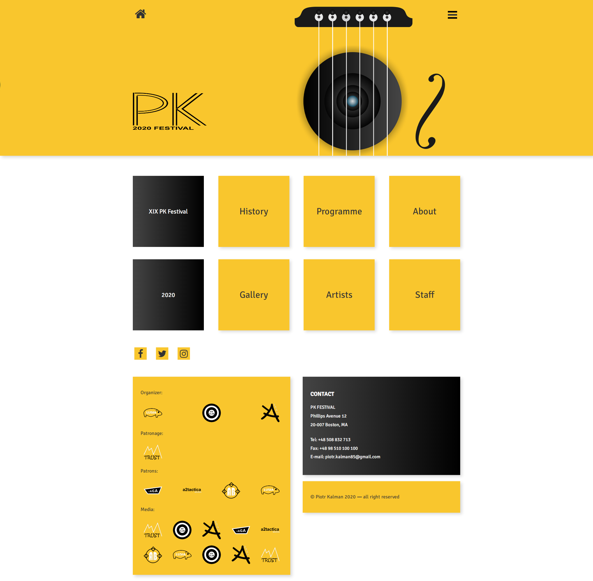

# PIOTR KALMAN - PK Festival

## General Info

> Hello, PK Festival is a site of imaginery festival. It's a single page application made with React and React Router

## Table of contents

- [General info](#general-info)
- [Technologies](#technologies)
- [Sections](#sections)
- [Instruction to tun](#instruction-to-run)
- [Instruction to use](#instruction-to-use)
- [Where to watch](#where-to-watch)
- [Mockup](#mockup)
- [Contact](#contact)

## Technologies

    React
    React-Router
    Sass
    Font-Awesome
    Api

## Sections

####

Common elements for every view

##### Header

- home button
- hamburger many button
- main image

##### Socials

- links to events twitter, facebook and instagram

##### Footer

- informations about sponsors
- contact component
- copyrights

####

Available Views:

- Home
- History
- Programme
- About
- Gallery
- Artists
- Staff

## Instruction to run

To run this application after cloning or downloading, make these steps:

npm install or yarn (please, be sure that you are in main project folder with package.json file)
npm start or yarn start

## Instruction to use

Fucntionality of this site is very simple and it's all about clicking :)

## Where to watch

To see this project in use, please visit: https://morswin19.github.io/event-site-react/#/

## Mockup

## Contact

Feel free to contact me: piotr.kalman85@gmail.com
